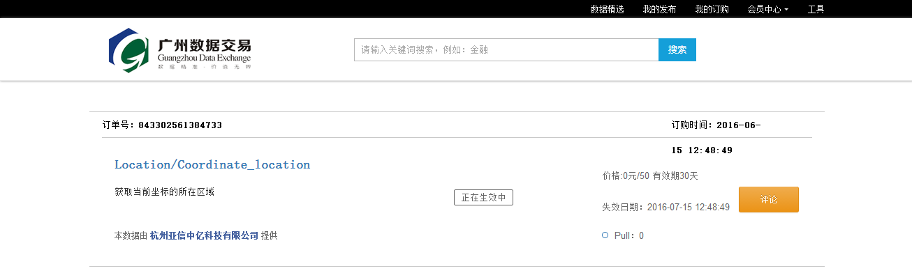

##下载数据

 
 

DataHub 提供的数据类型包括：批量数据、 API 数据和流式数据。

下载数据是数据需求方的行为，需要在网页端和 Client 客户端分步操作。在网页端您可以完成数据的"立刻订购"或"申请订购"，而 下载数据则需要通过 Client 客户端来完成。

####第一步：订购数据（网页端操作）

1)进入 DataHub 网站，查看、搜索 Repository 、 DataItem 后，选择需要订购的数据，根据数据提供方设定的不同权限，点击“立刻订购”或“申请订购”。

  
2)签订数据订购合约。甲方为数据需求方，乙方为数据提供方。

 
3)查看签约结果。订购成功后，可立即在 Client 客户端开始 pull 数据。

 
4)您可以在“我的订购”中查看全部的订单信息。

 
####第二步：数据下载（Client客户端操作）

#####创建 Datapool

如果需要下载数据，则必须创建相应的 Datapool 。

	datahub dp create mydp file:///home/usr/data/itempull

以上命令创建了一个名为 mydp 的 Datapool ，类型是 file ，路径是`/home/myusr/data/itempull , 用于存储即将下载 的数据。

如果成功，会显示：

	datapool create success, name: mydp type:file path:/home/myusr/data/itempull

#####数据下载

	datahub pull repotest/itemtest:tagtest mydp://mydir1 -d tagdestname.txt

以上命令下载了一个 Package 对应的数据到 mydp 中，子路径是 mydir1 。

如果成功，会显示：

	DataHub : repotest/itemtest:tagtest will be pulled into /home/myusr/data/itempull/repotest_itemtest/mydir1

在该文件夹下，您将会看到已经下载到本地的 tagdestname.txt 文件。

### 数据下载注意事项：

> “申请订购”需等待数据提供方批准，批准后数据需求方才可在 Client 客户端开始下载数据。在数据提供方批准前，数据需求方可在 DataItem 详情页点击“取消订购”，撤销“申请订购”。
